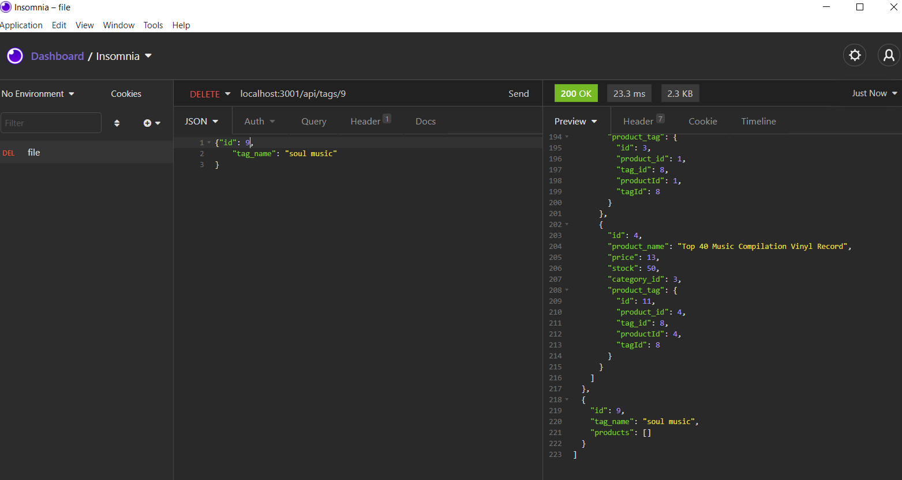
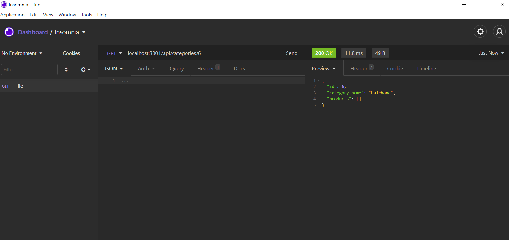
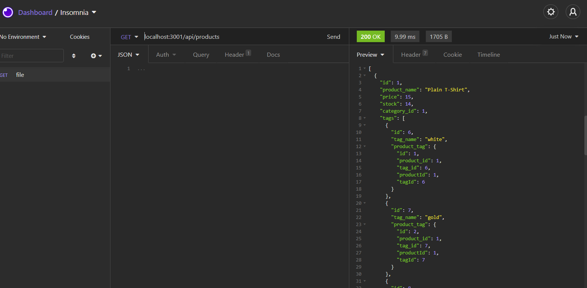

# E-commerce_backend

## Description

This ORM application that allows users to API POST, PUT, and DELETE routes in Insomnia Core.

DEMO 1: https://drive.google.com/file/d/1ojqf18vB6xLEqfTba4KegECyUEkMmp-D/view
DEMO 2: https://drive.google.com/file/d/1oT5pKtjSK4WKRO-fesyKmeumOgnYFDkU/view

## Useage

This Application allows the user to:

Test API POST, PUT, and DELETE routes in Insomnia Core 

Successfully create, update, and delete data in the database

## Installation

Dependencies neede for this project:

- MYSQL
- express
- sequelize 
- nodemon
- dotenv"

To install, on Command line use: `npm install`

After creating the models and routes, run `npm run seed` to seed data to your database so that you can test your routes.

## Tests

Run the schema from the MySQL shell.

To start the application’s server use the command: `node server` to start the localhost

In Insomnia App - GET routes to test all categories, all products, and all tags in Insomnia Core.
To Run Tags for example: use localhost:3001/api/tags in the "send" bar.

## Support

If you have any questions, or open issues about the repo, I can be reached at: 

Email: ahsan.ali0307@gmail.com 

GitHub: @ahsan13101994.

